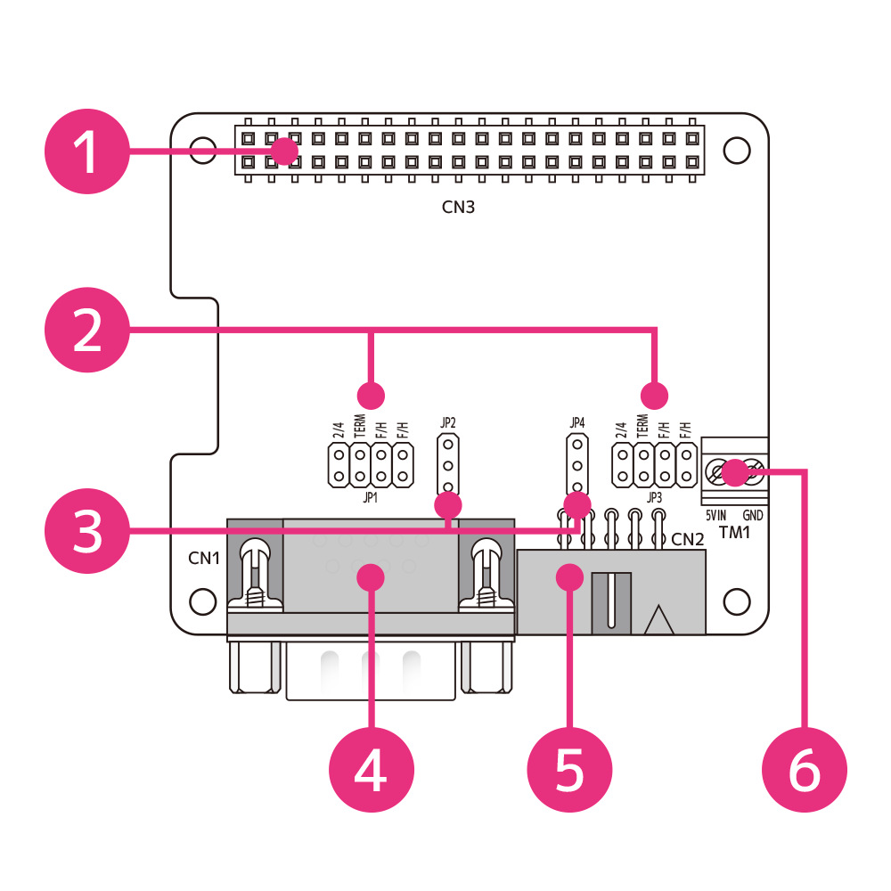
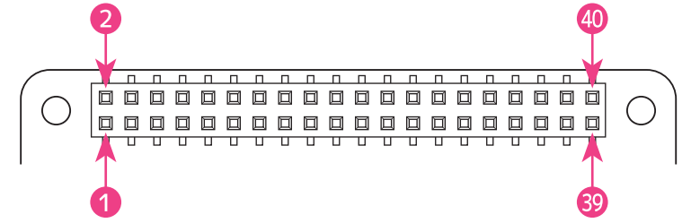
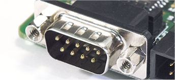
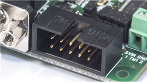
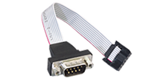
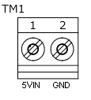

# RPi-GP60 Part name and description  
___  
## 1. Constituents  
The names of each part are as follows

  

| No | Name | Function |  
|:-----:|:-----|-----|  
|1|GPIO 40PIN connector|Raspberry Pi GPIO|  
|2|JP1/JP3 Jumper pin|Serial port0,1 Communication settings|  
|3|JP2/JP4 Jumper pin|Serial port0,1 Power settings|  
|4|CN1 DB-9 connector|Serial port0 |  
|5|CN2 10 Pin box-header|Serial port1 ||  
|6|TM1 External 5V input screw terminal|+ 5V supply-only power input to serial port pin 9|

*Compatible wires for external 5V input (screw terminals) are AWG26 to AWG16. The strip length is 5 mm.
___  
## 2. Description of terminals / connectors  
### 2-1. GPIO 40PIN connector  
Pin assignment and pin used of 40Pin GPIO are as follows

  

Pin assignment and description of 40Pin GPIO 

| PIN# | Signal name | description | PIN# | Signal name | description |  
|:---:|:---|:---|:---:|:---|:---|
|1|3.3V|3.3V power supply|2|5V|5V power supply|
|3|I2C SDA1/GPIO 2|I2C SDA1|4|5V|5V power supply|  
|5|I2C SCL1/GPIO 3|I2C SCL1|6|GND|GND|  
|7|GPIO 4|(unused)|8|GPIO 14|(unused)|  
|9|GND|GND|10|GPIO 15|(unused)|  
|11|IRQ/GPIO 17|IRQ input|12|GPIO 18|(unused)|  
|13|GPIO 27|Insulated power control|14|GND|GND|  
|15|GPIO 22|(unused)|16|GPIO 23|(unused)|  
|17|3.3V|3.3V power supply|18|GPIO 24|(unused)|  
|19|SPI0 MOSI/GPIO 10|(unused)|20|GND|GND|  
|21|SPI0 MISO/GPIO 9|(unused)|22|GPIO 25|(unused)|  
|23|SPI0 SCLK/GPIO 11|(unused)|24|SPI CE0/GPIO 8|(unused)|  
|25|GND|GND|26|SPI CE1/GPIO 7|(unused)|  
|27|I2C SDA0/GPIO 0|I2C for reading HAT_ID|28|I2C SCL0/GPIO 1|I2C for reading HAT_ID|  
|29|GPIO 5|(unused)|30|GND|GND|  
|31|GPIO 6|(unused)|32|GPIO 12|(unused)|  
|33|GPIO 13|(unused)|34|GND|GND|  
|35|GPIO 19|(unused)|36|GPIO 16|(unused)|  
|37|GPIO 26|(unused)|38|GPIO 20|(unused)|  
|39|GND|GND|40|GPIO 21|(unused)|  

### 2-2. Serial port0 [DB-9 connector]
Serial port 0 [CN1] uses a Dsub-9 pin connector.
 
Set the function with the jumper on the board.
RS-232C, RS-485 / RS-422A (half-duplex / full-duplex), and terminating resistor can be set.
In RS-232C mode, the D-Sub 9-pin terminal arrangement conforms to the EIA-574 standard.
In the case of RS-485 / RS-422A mode, it has a unique terminal arrangement.
See [RPi-GP60 Configuration and Installation](../setup/README.md) for more information.

### 2-3. Serial port1 [10-pin box header connector]
Serial port 1 [CN2] uses a 10-pin box header connector.
 
A D-Sub 9-pin conversion cable (about 10 cm) for connecting a 10-pin box header is included.
 
Set the function with the jumper on the board. 
RS-232C, RS-485 / RS-422A (half-duplex / full-duplex), and terminating resistor can be set.
In RS-232C mode, the D-Sub 9-pin terminal arrangement conforms to the EIA-574 standard.
In the case of RS-485 / RS-422A mode, it has a unique terminal arrangement.
See [RPi-GP60 Configuration and Installation](../setup/README.md) for more information.

### 2-4. External 5V input screw terminal
This external 5V power supply is used only when the serial port pin 9 [RI] is switched to [5V] in the jumper setting on the board.
The 5V input terminal arrangement is as follows.

|TM#-Pin#|Signal name|Function|  
|:---:|:---|:---|  
|TM1-1|5VIN|External 5V input（5V±10%）|  
|TM1-2|GND|External GND|  

*Compatible wires for external 5V input (screw terminals) are AWG26 to AWG16. The strip length is 5 mm.

___