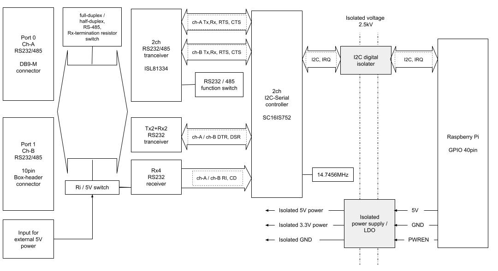
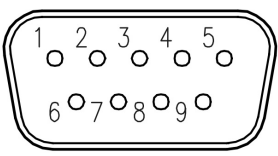
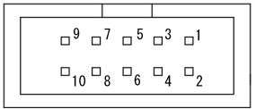
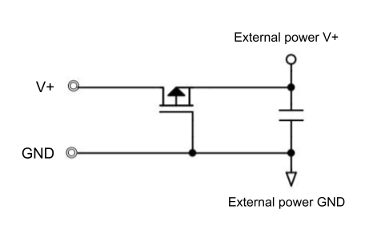

# Features and description of RPi-GP60
Each interface is explained below. The block diagram is as follows.  

  

___  
## 1. Interface  
### 1-1. Rapsberry Pi GPIO 40pin
To control the RPi-GP60, use the following signal of GPIO 40pin.
  
<u>Control signal</u>  
  
| PIN# | Name | Function description |
|:---:|:---|:---|
|3|I2C SDA1|I2C for serial controller|  
|5|I2C SCL1|I2C for serial controller|  
|11|GPIO17|Serial controller interrupt request 1: None / 0: Yes|  
|13|GPIO27|Isolated power control output  1:ON / 0:OFF|  
|27|GPIO0/ID_SD|I2C for reading HAT_ID|  
|28|GPIO1/ID_SC|I2C for reading HAT_ID|  

<u>Power supply terminal</u>  
  
|PIN#|Description|  
|:--:|:--:|  
|1pin 17pin|3.3V|  
|2pin 4pin|5V|  
|6pin 9pin 14pin 20pin 25pin 30pin 34pin 39pin|GND|  
  
### 1-2. I2C address
The I2C address for controlling the serial controller is as follows.

<u>2-port serial controller (SC16IS752)</u>
The I2C address setting of the serial controller (SC16IS752) can be changed with the solder jumper on the board.
The factory I2C address (7bit) is set to `0x4D`.
For how to change the settings, refer to [RPi-GP60 Settings and Installation](../setup/README.md).

### 1-3. Port 0 Serial Connector
The pin assign of Port 0 serial connector
  
CN1 DB9-Male Connector

There are the following three types depending on the jumper settings on the board.

|Pin no.|RS232 Signal name *1|I/O||Description|
|:--:|:--|:--:|:--|:--|
|1|DCD|I|Date Carrier Detect|Carrier Detect Input|
|2|RXD|I|Receive Data|Received data Input|
|3|TXD|O|Transmit Data|Transmit data Output|
|4|DTR|O|Data Terminal Ready|Data Terminal Ready Output|
|5|GND|-|Ground|Signal Ground|
|6|DSR|I|Data Set Ready|Data Set Ready Input|
|7|RTS|O|Request To Send|Request to send Output|
|8|CTS|I|Clear To Send|Crea to send Input|
|9|RI/5V *4|I/O|Ring Indicator / 5VOUT|Ring Indicator Input / External 5V output|  

*1: When the jumper pin JP1-1 setting is open [RS232]
*4: Jumper pin JP2 1-2 short circuit [RI] / 2-3 short circuit [5V] (external power output)

|Pin no.|RS485/422 Full duplex Signal name *2|I/O|Description|
|:--:|:--|:--:|:--|
|1|-|-|(No connection)|
|2|RXD-|I|Received data differential minus-side input|
|3|TXD-|O|Transmit data differential minus-side output|
|4|-|-|(No connection)|
|5|GND|-|Signal ground|
|6|RXD+|I|Received data differential plus-side input|
|7|TXD+|O|Transmission data differential plus-side output|
|8|-|-|(No connection)|
|9|(5V)|(O)|(external 5V output)|  

*2: Jumper pin JP1-1 setting is short [RS485 / 422], JP1-3,4 setting is open [full duplex]

|Pin ni.|RS485 Half duplex signal name *3|I/O|Description|
|:--:|:--|:--:|:--|
|1|-|-|(No connection)|
|2|DATA-|I/O|Data differential minus-side input / output|
|3|-|-|(No connection)|
|4|-|-|(No connection)|
|5|GND|-|Signal ground|
|6|DATA+|I/O|Data differential plus-side input / output|
|7|-|-|(No connection)|
|8|-|-|(No connection)|
|9|(5V)|(O)|(external 5V output)|  

*3: Jumper pin JP1-1 setting is short [RS485 / 422], JP1-3,4 setting is short [half duplex]

### 1-4. Port 1 serial connector
The pin assign of Port 1 serial connector

CN2 10 pin box header connector
* If you connect the included "D-Sub 9-pin conversion cable for 10-pin box header connection (about 10 cm)", the terminal arrangement will be the same as port 0.

There are the following three types depending on the jumper settings on the board.

|Pin no.|RS232 Signal name *5|I/O||Description|
|:--:|:--|:--:|:--|:--|
|1|DCD|I|Date Carrier Detect|Carrier Detect Input|
|2|RXD|I|Receive Data|Received data Input|
|3|TXD|O|Transmit Data|Transmit data Output|
|4|DTR|O|Data Terminal Ready|Data Terminal Ready Output|
|5|GND|-|Ground|Signal ground|
|6|DSR|I|Data Set Ready|Data Set Ready Input|
|7|RTS|O|Request To Send|Request To Send Output|
|8|CTS|I|Clear To Send|Clear To Send Input|
|9|RI/5V *8|I/O|Ring Indicator / 5VOUT|Ring Indicator Input / External 5V output|
|10|-|-||Not connected|  

*5: When the jumper pin JP3-1 setting is open [RS232]
*8: Jumper pin JP4 1-2 short circuit [RI] / 2-3 short circuit [5V] (external power output)

|Pin no.|RS485/422 Full deplex signal name *6|I/O|Description|
|:--:|:--|:--:|:--|
|1|-|-|(No connection)|
|2|RXD-|I|Received data differential minus-side Input|
|3|TXD-|O|Transmit data differential minus-side Output|
|4|-|-|(No connection)|
|5|GND|-|Signal ground|
|6|RXD+|I|Received data differential plus-side Input|
|7|TXD+|O|Transmission data differential plus-side Output|
|8|-|-|(No connection)|
|9|(5V)|(O)|(external 5V output)|
|10|-|-|Not connected|  

*6: Jumper pin JP3-1 setting is short [RS485 / 422], JP3-3,4 setting is open [full duplex]

|Pin no.|RS485 Half duplex signal name *7|I/O|Description|
|:--:|:--|:--:|:--|
|1|-|-|(No connection)|
|2|DATA-|I/O|Data differential minus-side input / output|
|3|-|-|(No connection)|
|4|-|-|(No connection)|
|5|GND|-|Signal ground|
|6|DATA+|I/O|Data differential plus-side input / output|
|7|-|-|(No connection)|
|8|-|-|(No connection)|
|9|(5V)|(O)|(external 5V output)|
|10|-|-|Not connected|  

*7: Jumper pin JP3-1 setting is short [RS485 / 422], JP3-3,4 setting is short [half duplex]

### 1-5. External 5V input
The external 5V input is used only when the 9th terminal [RI] of the serial connector is set to [5V].
The input voltage is 5V (± 10%).
The circuit configuration is as shown below, and a P-ch MOSFET for reverse polarity connection protection is attached.
  

## 2. Serial controller  
NXP SC16IS752 is used as the serial controller.
The initial value of the I2C address (7bit) is `0x4D`, and the setting can be changed with the solder jumper on the board.
For details on the setting method, refer to [RPi-GP60 Setting and Installation] (../setup/README.md).

### 2-1. SC16IS752 Register Map
The register map of SC16IS752 is as follows. For details on the function of each register, refer to NXP's [SC16IS752 Data Sheet](../datasheet).
However, if the SC16IS752 serial driver is controlled by the kernel as a TTY, the user program will not be able to access the registers with I2C commands.
For python, control via the driver is available by using the [pyserial module](https://pythonhosted.org/pyserial/index.html).
See also [Serial Communication Sample Program](../python/README.md) using the pyserial module.

|Adrs|name|Read mode|Write mode|
|:--:|:--|:--|:--|
|0x00|RHR/THR|Receive Holding Register (RHR)|Transmit Holding Register (THR)|
|0x01|IER|Interrupt Enable Register (IER)|Interrupt Enable Register|
|0x02|IIR/FCR|Interrupt Identification Register (IIR)|FIFO Control Register (FCR)|
|0x03|LCR|Line Control Register (LCR)|Line Control Register|
|0x04|MCR|Modem Control Register (MCR)|Modem Control Register|
|0x05|LSR|Line Status Register (LSR)|n/a|
|0x06|MSR|Modem Status Register (MSR)|n/a|
|0x07|SPR|Scratchpad Register (SPR)|Scratchpad Register|
|0x06|TCR|Transmission Control Register (TCR)|Transmission Control Register|
|0x07|TLR|Trigger Level Register (TLR)|Trigger Level Register|
|0x08|TXLVL|Transmit FIFO Level register|n/a|
|0x09|RXLVL|Receive FIFO Level register|n/a|
|0x0A|IODir|I/O pin Direction register|I/O pin Direction register|
|0x0B|IOState|I/O pins State register|n/a|
|0x0C|IOIntEna|I/O Interrupt Enable register|Interrupt Enable register |
|0x0E|IOControl|I/O pins Control register|I/O pins Control register|
|0x0F|EFCR|Extra Features Control Register|Extra Features Control Register|
|0x00|DLL|Divisor Latch LSB (DLL)|Divisor Latch LSB|
|0x01|DLH|Divisor Latch MSB (DLH)|Divisor Latch MSB|
|0x02|EFR|Enhanced Features Register (EFR)|Enhanced Features Register|
|0x04|XON1|Xon1 word|Xon1 word|
|0x05|XON2|Xon2 word|Xon2 word|
|0x06|XOFF1|Xoff1 word|Xoff1 word|
|0x07|XOFF2|Xoff2 word|Xoff2 word|

### 2-2. Baud rate setting
A 14.7456MHz crystal unit is used as the clock for the SC16IS752.
The setting values of a typical baud rate generator (DLL, DLH) are as follows.

|Baud rate [bps]|Settings|Remarks|
|--:|--:|:--|
|110|8378||
|300|3072||
|1200|768||
|2400|384||
|4800|192||
|9600|96||
|14400|64||
|19200|48||
|38400|24||
|57600|16||
|115200|8|Flow control is recommended because it exceeds I2C speed (standard 100kHz)|
|230400|4||
|460800|2|Upper limit when RS232 is set (upper limit of transceiver performance)|
|921600|1|Upper limit when RS485 / 422 is set (controller upper limit)||

___