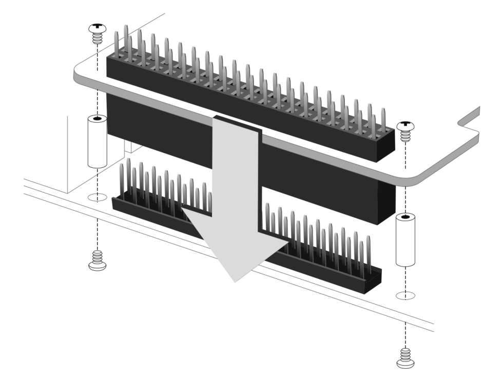

# Setting and installation of RPi-GP60
<a name="settingAndInstalletionRPi0GP60"></a>
This section describes various settings of this product and how to connect this product to the GPIO 40 PIN of Raspberry Pi.

___  
## 1. Hardware settings
  

### 1-0. Disable ID EEPROM
Since April 2021, the RPi-GP60 has been shipped with the ID EEPROM disabled.(Jumper resistor [RJ1] is not mounted)
For RPi-GP60 shipped before April 2021, it has been confirmed that the ttySC* port is not recognized when combined with Raspberry PI 4B.
This can be improved by removing the jumper resistor [RJ1] and disabling the ID EEPROM.

### 1-1. I2C address setting
The I2C address of the serial controller SC16IS752 can be changed by opening / shorting the solder jumpers (A0, A1).
* The default setting is `0x4D` (A0 to A1 open).

|A1|A0|I2C address||
|:--:|:--:|:--:|:--:|
|Open|Open|0x4D|*default|
|Open|Short|0x4C||
|Short|Open|0x49||
|Short|Short|0x48||

### 1-2. Serial communication function settings
Jumper setting pin on the board JP1 sets the communication function of Port0 (CN1), and JP3 sets the communication function of Port1 (CN2).
All factory settings are open.
  

|JP1/JP3<br>Pin#|Open(OFF)|Short(ON)|Description|  
|:--:|:--|:--|:--|  
|1|RS232|RS485/422|Set whether to use RS232 mode or RS485 / 422 mode.<br>The factory setting is open and RS232 mode.
|2|Terminating resistor disabled|Terminating resistor effective|In RS485 / 422 mode, disable / enable the 120Ω terminating resistor on the differential receiver.<br>Be sure to open it in RS232 mode.|  
|3|Full duplex|Half duplex|Sets the RS485 half-duplex mode.<br>Set open for RS232 or RS422 (Full Duplex) mode.|
|4|Full duplex|Half duplex|Sets the RS485 half-duplex mode.<br>Set open for RS232 or RS422 (Full Duplex) mode.|  

### 1-3. External power supply settings
Jumper setting pin JP2 sets the function of pin 9 of CN1 and JP4 to set the function of pin 9 to RI or external power output. The factory setting is RI.
  

|JP2/JP4|Function|Description|  
|:--:|:--|:--|  
|1-2 Short|RI|Set pin 9 of CN1 and CN2 as RI. (Factory setting)|  
|2-3 Short|5V|Set the 9th pin of CN1 and CN2 as the external power supply 5V output.|  

### 1-4. RS232 driver / receiver
This is the circuit configuration of the driver / receiver section when RS232 is set.
  

### 1-5. RS485 / 422 driver / receiver
This is the circuit configuration of the driver / receiver section when RS485 / 422 is set.
  

### 1-6. RS485 half-duplex connection example
Bidirectional data transmission is possible with multiple drivers and receivers connected in a daisy chain. (Multi-point method)
Up to 32 devices can be connected.
Enable the terminating resistors at both ends that have the longest wiring length, and disable the other terminating resistors.
In addition, by using a twisted pair cable for the electric wire, common mode noise caused by electromagnetic induction can be efficiently removed by the differential receiver.
  

### 1-7. RS422 full duplex connection example
You can connect multiple slaves to one master. Up to 10 receivers can be connected to one driver. (Multi-drop method)
Enable the terminating resistor of the receiver that has the longest wiring length, and disable the terminating resistor of the other receivers.
In addition, by using a twisted pair cable for the electric wire, common mode noise caused by electromagnetic induction can be efficiently removed by the differential receiver.
  

### 1-8. Comparison of each standard
The standard defines it as follows, but it may be less than the maximum value in the actual usage environment.

|Item|RS-232C|RS-485|RS-422A|  
|:--|:--|:--|:--|  
|Compliant standard|TIA/EIA-232-F|TIA/EIA-485-A|TIA/EIA-422-B|  
|Terminal array standard|EIA-574|Original|Original|  
|Operation mode|Non-equilibrium (single-ended)|Balanced (differential)|Balanced (differential)|
|Maximum number of connectable devices|1 driver, 1 receiver|32 drivers, 32 receivers<br>Supports half-duplex multipoint system|10 slave receivers in 1 master driver<br>Full-duplex multi-drop system|
|Maximum cable length (standard value)|15m|1200m<br>Twisted pair cable recommended|1200m<br>Twisted pair cable recommended|
|Maximum transmission speed (standard value)|20Kbit/s|10m - 35Mbit/s<br>1200m – 100Kbit/s|1.2m – 10Mbit/s<br>1200m – 100Kbit/s|  
|Maximum transmission speed (actual value)|460Kbps|920Kbps|920Kbps|  
|Features|Short-range one-to-one communication<br>Full duplex|Long-distance N-to-N communication<br>Half-duplex / full-duplex|Long-distance 1-master to N-slave communication<br>Full-duplex|
___  
## 2. Assembly of the main body
Attach the 40PIN pin header that comes with the product vertically from the bottom of the product.
*Note) The tip of the 40PIN pin header is sharp, so be careful not to get injured.

  

  


## 3. Connection with Raspberry Pi board
Connect this product to the GPIO pin header of the Raspberry Pi main unit.
Align the spacer (supplied) with the screw hole of the main body of this product, fix the spacer with the attached screw (4pcs), and insert it vertically into the GPIO pin of Raspberry Pi as it is.
Once the spacer is fitted to the Raspberry Pi board, the connection is complete.
After that, use the attached screws (4pcs) from the back of the Raspberry Pi to fix the spacer.
* Use spacers and screws on the other side in the same way to fix the main body.

  


## 4. Serial driver settings
<a name="serialDriverSettings"></a>
The SC16IS752 I2C driver is provided as standard on the Raspberry-pi.
By registering with the following procedure, the two serial ports will be recognized as ttys.
### SC16 IS752 I2C driver registration and confirmation procedure
1. Edit config.txt with nano
    ```
    $ sudo nano /boot/config.txt
    ```

1. Add the following two lines to the last line
    ```
    gpio=27=op,dh
    dtoverlay=sc16is752-i2c,int_pin=17,addr=0x4d,xtal=14745600
    ```
    If you changed the address in "1-1. Setting the I2C address", rewrite [addr = 0x4d] as appropriate.
    For RaspiOS after August 2020, GPIO27 must be set to High and the isolated power of RPi-GP60 must be turned on before overlaying.

1. Write with CTRL + O, exit with CTRL + X

1. Reboot the system

1. After rebooting, make sure the following tty ports [/ ttySC0], [/ ttySC1] are added to the device tree
    ```
    $ ls /dev/ttySC*
    /dev/ttySC0  /dev/ttySC1
    ```